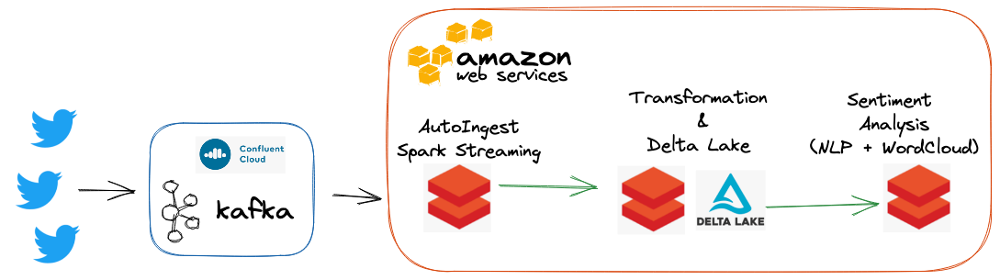

<h1 align="center">Starbucks Twitter Sentiment Analysis </h1>
<p align="center" width="100%">
    
</p>


> Technologies used: 
Apache Kafka, Spark Structured Streaming, Confluent Cloud, Databricks, Delta Lake, Spark NLP


**All details of the project is described in [HERE](https://youheekil.github.io/tags/sentiment-analysis/).**
## 1. Aim

The aim of the Starbucks Twitter Sentimental Analysis project is to build end-to-end twitter data streaming pipeline to analyze brand sentiment analysis. 

<p align="center" width="100%">
    
</p>

## 2. Environment Setup 

* Set up the Virtual Environment
```
pip install virtualenv
virtualenv --version # test your installation 
virtualenv ccloud-venv
```
### Step 1. Twitter API Credentials

As we performed in the previous [post](https://youheekil.github.io/running-kafka-docker/), we need to get [Twitter API Credentials](https://developer.twitter.com/en/docs/twitter-api/getting-started/getting-access-to-the-twitter-api). After getting it, we save these credential information in `.env` file. 
Make sure to include `.env` file in `.gitignore` to be ignored in the future. 

```.env
# .env
CONSUMER_KEY = "<api key>"
CONSUMER_SECRET = "<api secret>"
ACCESS_TOKEN_KEY = "<access key>"
ACCESS_TOKEN_SECRET = "<access secret>"
```
### Step 2. Confluent Cloud

> Confluent Cloud is a resilient, scalable streaming data service based on Apache Kafka®, delivered as a fully managed service - [Confluent Cloud](https://docs.confluent.io/cloud/current/get-started/index.html). It offers users to manage cluster resources easily. 

#### 2-1. Create a Confluent Cloud account and Kafka cluster
First, create a free Confluent Cloud account and create a kafka cluster in [Confluent Cloud](https://docs.confluent.io/cloud/current/get-started/index.html). I created a basic cluster which supports single zone availability with `aws` cloud provider.

#### 2-2. Create a Kafka Topic named `tweet_data` with 2 partitions. 

From the navigation menu, click `Topics`, and in the Topics page, click `Create topic`. I set topic name as `tweet_data` with 2 partitions, the topic created on the Kafka cluster will be available for use by producers and consumers. 

### Step 3. Confluent Cloud API credentials. 

#### API keys
From the navigation menu, click `API keys` under `Data Integration`.  If there is no available `API Keys`, click `add key` to get a new API keys (API_KEY, API_SECRET) and make sure to save it somewhere safe. 


#### HOST: Bootstrap server 

From the navigation menu, click `Cluster settings` under `Cluster Overview`. You can find `Identification` block which contains the information of `Bootstrap server`. Make sure to save it somewhere safe. It should be similar to `pkc-w12qj.ap-southeast-1.aws.confluent.cloud:9092`

HOST = pkc-w12qj.ap-southeast-1.aws.confluent.cloud

#### Save those at `$HOME/.confluent/python.config`

```shell
vi $HOME/.confluent/python.config
```

Press `i` and **copy&paste the file below** !

```
#kafka
bootstrap.servers={HOST}:9092 
security.protocol=SASL_SSL
sasl.mechanisms=PLAIN
sasl.username={API_KEY}
sasl.password={API_SECRET}   
```

Then, replace HOST, API_KEY, API_SECRET with the values from `Step 3`. Press `:wq` to save the file.  

### Step 4. Create a Databricks Cluster 

Check [HERE](https://youheekil.github.io/project1-1.-starbucks-twitter-sentimental-analysis/#step-4-create-a-databricks-cluster) FOR the procedure of creating a Databricks Cluster


### Step 5. Some modifications are needed for twitter data ingestion

```dockerfile
# Dockerfile

FROM python:3.7-slim

COPY requirements.txt /tmp/requirements.txt
RUN pip3 install -U -r /tmp/requirements.txt

COPY producer/ /producer

CMD [ "python3", "producer/producer.py", 
  "-f", "/root/.confluent/librdkafka.config", 
  "-t", "<your-kafka-topic-name>" ]

```
## Build and run the Docker Container 

```Shell 
# cd <your-project_folder> 
# source ./ccloud-venv/bin/activate

bash run.sh
``` 

### Final Sentimental Analysis 
Click [here](https://github.com/youheekil/twitter-sentiment-analysis/blob/main/Starbucks%20Sentimental%20Analysis.pdf) to check the presentation file
